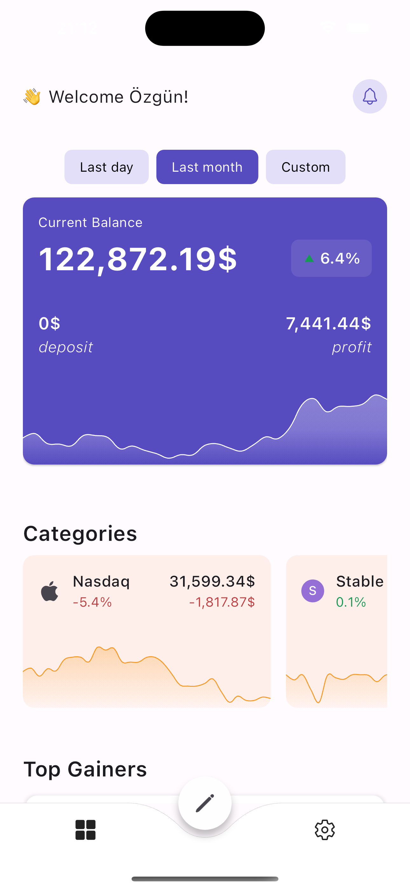
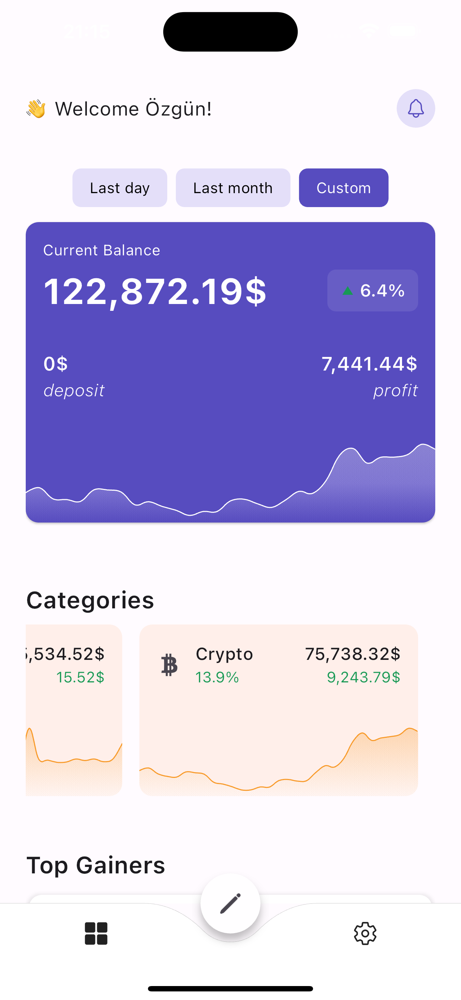
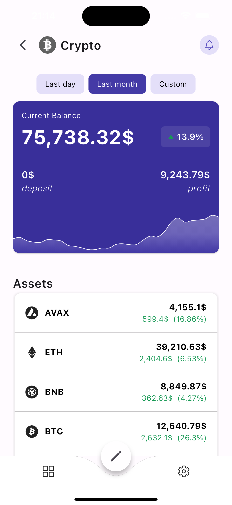
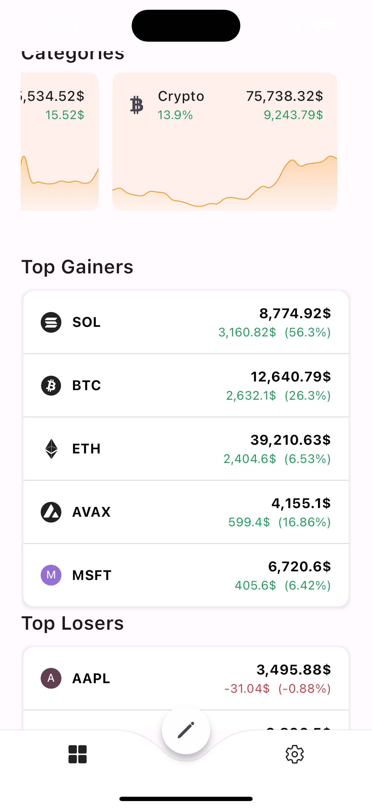
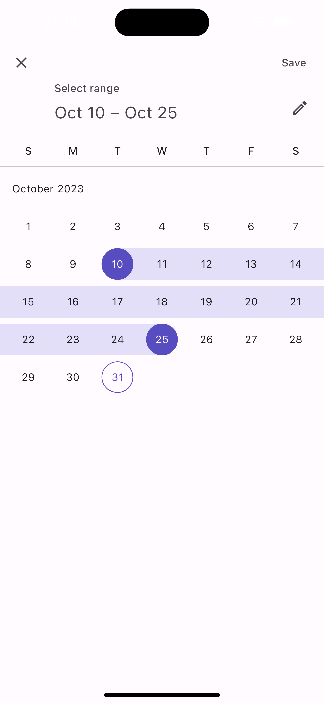

# HowMuch

HowMuch is an open-source *Aggregate Portfolio Tracker and Report Generator*. It is a flutter
project, and being developed for both Android and iOS.

It solves 2 problems:

1. tracking multiple assets from multiple categories
2. generating reports for custom date intervals

## The Problem:

I started developing this application due to my personal needs.

1. I have assets in the following 3 categories: stock, crypto, forex.
2. In each category, I have several assets.
3. I am of course buying and selling some assets throughout my investing journey.
4. Day by day, it becomes way harder to keep track of "HowMuch did I earn from this investment"...
    - this is especially true, if I made several buy-sell on the same asset (say, I bought and sold
      BTC from different prices, multiple times).

*imagine keeping track of all the assets...*

At one point, I got tired, and stopped keeping track of them. But that disturbed me. Since, my
future decisions could be much more informed if I knew:

- HowMuch I deposited to stock, HowMuch I profited from crypto, HowMuch I withdrew from forex,
- HowMuch did I earn from AAPL, HowMuch did I deposit to ETH, etc.

And it would be even more wonderful, if I could retrieve this information based on custom time
periods (say, for the last 2 months only).

I did some research, but couldn't find any good application. And you know, as a developer, there was
only one solution left:

## How it works (roughly)

You enter your assets (manually, for security reasons), and HowMuch keeps track of your portfolio.

HowMuch categorizes your assets, and generates reports for you.
These reports include:  how much has:

- your portfolio,
- your categories,
- and your assets changed.

These reports are super intuitive and easy to understand, you can inspect them at 3 different
levels (from general to detailed):

### Reports

HowMuch displays the reports it generates to you at 3 different levels:

1. **Dashboard** -> _[high-level summary]_
    - current balance of your whole portfolio
    - rate change of your overall balance
    - deposit/withdrawal
    - amount change
2. **Category level** (per category, for example: stock) -> _[mid-level details]_
    - current balance of the category: total amount of assets in this category
    - rate change for the category
    - deposit/withdrawal
    - amount change
3. **Asset level** (per asset, for example: AAPL) -> _[low-level details]_
    - total amount of the asset
    - rate change for the asset
    - amount change

### Dashboard

### Category page:

## Features:

- you can add assets from the following categories:
    - Stocks (AAPL, AMZN, etc.)
    - Crypto currencies (BTC, ETH, etc.)
    - Forex (USD, EUR, gold, platinum, etc.)
- your assets will be grouped by their categories
- you can assign custom categories to your assets
- you can track your portfolio by daily generated reports
- you can enter custom dates for reports: a custom report will be generated for all the change
  happened in your portfolio during the time you entered.
- top gainers and top losers will be displayed for the report

### Top Gainers & Losers

### Custom Date Selection:

## What does an open-source mobile application mean?

- it means, you can be a part of this application!
- you can submit new feature requests
- you can submit bug reports
- you can submit your PR, and can enhance the application w.r.t your needs (if they align with the
  communities as well)
- if you are just learning, or curious, just take a look at the source-code!
- and all your contribution will be visible at your phone, every time you use this application

## But deploying a mobile app is not free? How come this is open-sourced?

- Having a developer apple account is not free, I'm covering the cost of it myself, no worries!
- Publishing on Android (play store) is also not free, and that's ok as well :)
- I'm using firebase as the backend solution, it is free till a threshold. If the app becomes
  popular, and we hit that threshold, I expect we will have some sponsors by that time 🎉

## Technical Summary

Being a considerate developer, I documented all my decisions and insights
to [design decisions](design_decisions.md) file. So that, you won't have to take wild-guesses on why
the code is written the way it is.

1. Frontend is a Flutter project (iOS and Android) -> dart
2. Backend is Firebase -> TypeScript

### Flutter

- GetX is used for state management (controllers, routing, etc.)
- tried to keep it as native and as minimal as possible
- it's my first time writing Flutter, so you better lower your expectations :D
- this was a side-hustle, and somewhat a quick and dirty solution. Unfortunately, I did not have the
  time spend extra effort on mobile-app testing. Feel free to open a PR for introducing tests on the
  Flutter side

### Firebase

- nothing weird going on here, tried to follow most up-to-date best practices.
- client cannot access firestore directly, has to call cloud functions for interacting with the
  database.
- tests are present, so you can take a look at them to get the big picture of the server.
- you won't see the firebase related configurations and files in the repository. This was a
  deliberate choice. These config files might be confusing for the ones who will create their own
  firebase project (these config files are generated automatically). And sharing them here will
  serve no purpose for the development of the app.
- the code for the firebase backend can be found in this repo: #TODO

## Non-code contributors (alphabetical order)

- [Canberk Karakaş](https://www.instagram.com/canberk1.0/) (logo / splash screen)
- [Cem Tunaboylu](https://github.com/cemtunaboylu) (technical discussions)
- [İlayda Özgül](https://www.behance.net/laydazgl) (UI/UX - Figma)
